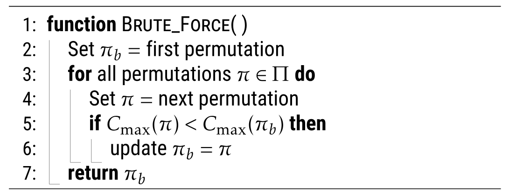
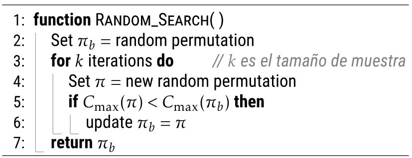

# Introducción: Investigación operativa

**Scheduling** (programación de tareas). Consiste en asignar recursos a actividades en el tiempo. Matemáticamente estos problemas están calificados como los más difíciles.

## Flow Shop Scheduling Problem (FSSP)

Es un problema de líneas de producción. Los *J* trabajos deben ser procesados en 
las *M* máquinas con tiempos fijos *P*, y son independientes para cada 
trabajo. Además, asumimos que los tiempos de trabajo ya han sido optimizados.

*Figura 1. Instancia a analizar*

Rápidamente, sin analizar el tiempo que puede demorar encontrar la solución óptima, 
podemos pensar en diseñar un algoritmo de fuerza bruta. Es sencillo para nosotros 
pero imposible para la máquina.

*Figura 2. Algoritmo de fuerza bruta*

### ¿Qué es una Heurística?

Procedimiento simple diseñado de manera inteligente para crear una solución o para 
buscar mejores soluciones que satisfagan cierto problema de optimización.

- Idea, criterio, método o regla que ayuda a decidir cuál alternativa es mejor.
- Idea basada en la intuición o en el sentido común.
- Idea que utiliza la estructura o contexto del problema.

La primera heurística en la historia fue nombrada *Método Monte Carlo* y se basaba 
en escoger una muestra del total y observar cuántos cumplen con el propósito.

#### Búsqueda aleatoria para el FSSP

Selecciona una muestra aleatoria extraída del espacio de soluciones para encontrar 
un resultado numérico (media esperada, mejor, peor).

*Figura 3. Búsqueda aleatoria*

Este enfoque es muy general y puede ayudar a resolver otros tipos de problemas. Sin 
embargo, no es el mejor para resolver el problema propuesto:

- La muestra puede ser demasiado pequeña y no representativa.
- La media de la muestra es aproximadamente la media de la población.
- El mejor de la muestra no es el mejor de la población.

---

Los temas a tratar en este repositorio son los siguientes

# Métodos heurísticos básicos :eyes:

## Heurísticas Constructivas

Construyen una solución desde cero, añadiendo uno a uno los componentes a la solución 
parcial, hasta que la solución esté completa. La pregunta importante para diseñar 
esta heurística es:

> **¿Cuál elemento debería añadir y cómo?**

Veremos cómo utilizando la aceleración de Taillard mejora le eficiencia del 
funcionamiento de la heurística.

## Heurísticas de Búsqueda Local

Comienzan desde una solución inicial (puede ser aleatoria), intentan reemplazar 
la solución actual por una mejor solución vecina, repiten este paso hasta que 
no hayan mejores soluciones vecinas. La pregunta que que ayuda a diseñar 
correctamente la Heurística es: 

> **¿Qué cambio podría mejorar esta solución?**

# Metaheurísticas :skull:

## Metaheurísticas iterativas

### Búsqueda local iterativa (ILS)

### Algoritmo iterativo goloso (IG)
