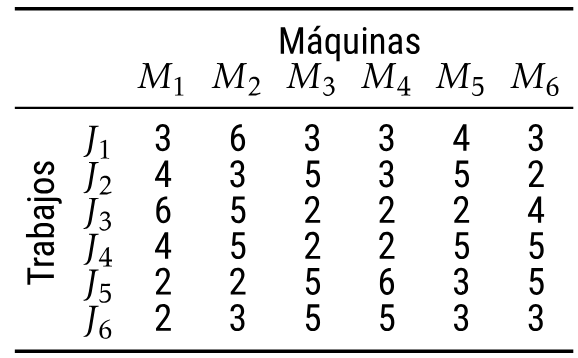
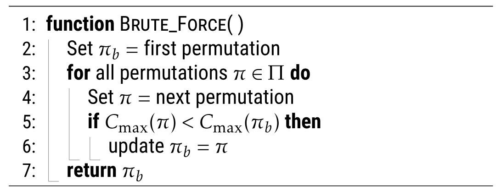
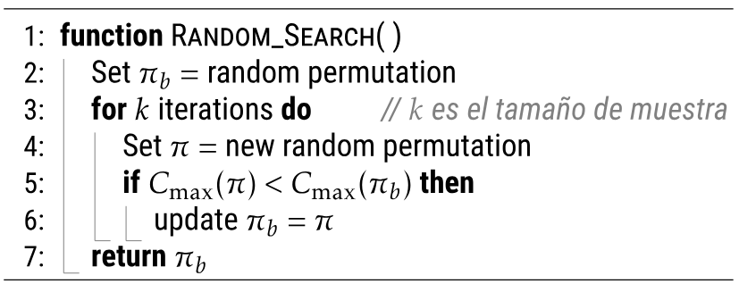
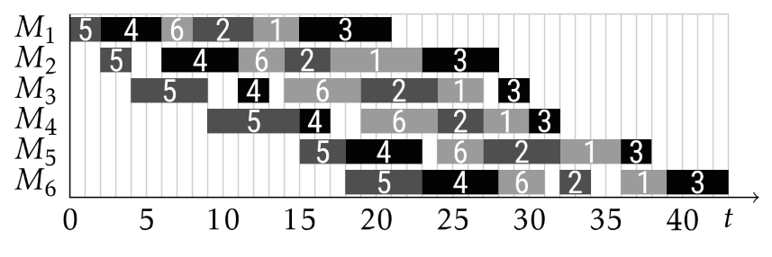

# Introducción: Investigación operativa

**Scheduling** (programación de tareas). Consiste en asignar recursos a actividades 
en el tiempo. Matemáticamente estos problemas están calificados como los más 
difíciles.

## Flow Shop Scheduling Problem (FSSP)

Es un problema de líneas de producción. Los *J_j* trabajos deben ser procesados en 
las *M_i* máquinas con tiempos fijos *P_ji* [1], y son independientes para cada 
trabajo. Además, asumimos que los tiempos de trabajo ya han sido optimizados.

<div style="text-align: center;">
  
  <p><em>Figura 1: Instancia a analizar [1]</em></p>
</div>

Rápidamente, sin analizar el tiempo que puede demorar encontrar la solución óptima, 
podemos pensar en diseñar un algoritmo de fuerza bruta. Es sencillo para nosotros 
pero imposible para la máquina.

<div style="text-align: center;">
  
  <p><em>Figura 2: Algoritmo de fuerza bruta [1]</em></p>
</div>

### ¿Qué es una Heurística?

Procedimiento simple diseñado de manera inteligente para crear una solución o para 
buscar mejores soluciones que satisfagan cierto problema de optimización.

- Idea, criterio, método o regla que ayuda a decidir cuál alternativa es mejor.
- Idea basada en la intuición o en el sentido común.
- Idea que utiliza la estructura o contexto del problema [1].

La primera heurística en la historia fue nombrada *Método Monte Carlo* y se basaba 
en escoger una muestra del total y observar cuántos cumplen con el propósito.

#### Búsqueda aleatoria para el FSSP

Selecciona una muestra aleatoria extraída del espacio de soluciones para encontrar 
un resultado numérico (media esperada, mejor, peor).

<div style="text-align: center;">
  
  <p><em>Figura 3: Búsqueda aleatoria [1]</em></p>
</div>

Este enfoque es muy general y puede ayudar a resolver otros tipos de problemas. Sin 
embargo, no es el mejor para resolver el problema propuesto:

- La muestra puede ser demasiado pequeña y no representativa.
- La media de la muestra es aproximadamente la media de la población.
- El mejor de la muestra no es el mejor de la población [1].

---

# Implementación de heurísticas básicas

Nuestro objetivo en esta sección será implementar 2 heurísticas básicas: heurística 
Constructiva y heurística de búsqueda local, para calcular el `makespan` de FSSP. 
Lo primero que vamos hacer es cargar correctamente las instancias que 
analizaremos, luego implementaremos el cálculo del `makespan` de una permutación 
específica, finalmente implementaremos las dos heurísticas propuestas para 
calcular la **permutación óptima**.

## Instancias de FSSP

En el directorio [flowshop/](./flowshop/) se encuentran 121 instancias. Las 
instancias son archivos con el formato *ASCII text* los cuales estan disponibles 
para ser cargados y usados en el cálculo del `makespan`. El formato de archivo de 
datos para el FSSP comienza con dos números en la primera linea: el número de 
trabajos y el número de máquinas [2]. Por ejemplo, veamos la estructura de la 
instancia [flowshop/br66](./flowshop/br66)

```zsh
6 6
0 3 1 6 2 3 3 3 4 4 5 3
0 4 1 3 2 5 3 3 4 5 5 2
0 6 1 5 2 2 3 2 4 2 5 4
0 4 1 5 2 2 3 2 4 5 5 5
0 2 1 2 2 5 3 6 4 3 5 5
0 2 1 3 2 5 3 5 4 3 5 3
```
Luego, el archivo tiene *nT* líneas, una para cada trabajo. Cada línea tiene *2 x mM*
columnas para ese trabajo; es decir, tiene dos columnas para cada actividad de ese 
trabajo: **el número de la máquina y le timepo de procesamiento** [2].

## La función `cargar`

El objetivo es cargar correctamente una instancia en una arreglo bidimensional 
(matriz). En esta ocasión a nosotros solo nos importa los tiempos de procesamiento 
de cada trabajo en cada máquina, por ello vamos a obviar cargar el número de la 
máquina.

```cpp
#include <bits/stdc++.h>
using namespace std;

int nT, mM, P[900][70];

void cargar(string nombre) {
  ifstream archivo(nombre);
  archivo >> nT >> mM;
  int basura;
  for (int j = 0; j < nT; j++)
    for (int i = 0; i < mM; i++)
      archivo >> basura >> P[j][i];
}
```

Como observamos, *nT* y *mM* es el número de trabajos y el número de máquinas, 
respectivamente. Luego, *basura* es el **número de la máquina**, que nos nos 
importa en este análisis. Podemos comprobar la carga exitosa imprimiendo los 
valores desde la matriz *P*.

```cpp
int main(void) {
  cargar("flowshop/br66");
  for (int j = 0; j < nT; j++) {
    for (int i = 0; i < mM; i++)
      cout << P[j][i] << " ";
    cout << "\n";
  }
}
```

Como resultado tenemos que la matriz de tiempos de procesamiento, donde 
**<samp>P[j][i]</samp>** indica el tiempo necesario para que la tarea 
**<samp>j</samp>**se procese en la máquina **<samp>i</samp>**., donde confirmamos 
la correcta carga de los datos de cualquier instancia con el formato presentado.

```zsh
3 6 3 3 4 3
4 3 5 3 5 2
6 5 2 2 2 4
4 5 2 2 5 5
2 2 5 6 3 5
2 3 5 5 3 3

```

## La función `makespan`

El `makespan` es el tiempo total de procesamiento de los **<samp>j</samp>** 
trabajos en las **<samp>i</samp>** máquinas (no confudir con el tiempo de la 
suma de procesamientos de los **<samp>j</samp>** trabajos en las 
**<samp>i</samp>** máquinas). Analicemos un ejemplo con la siguiente 
permutación.

<div style="text-align: center;">
  
  <p><em>Figura 4: Una posible permutación [1]</em></p>
</div>

En este caso, el `makespan` es **43**. Para hallar este número podemos calcular 
los tiempo de iniciación más temprana para cada trabajo en cada máquina. Luego, 
una vez obtenida dicha matriz, estaremos seguros de que la última fila y en la 
última fila se encuentra el `makespan` de esa permutación.

```cpp
int EF[900][70];

int makespan(vector<int> &S) {
  fill(&EF[0][0], &EF[0][mM], 0);
  int k = 1;
  for (auto j : S) {
    EF[k][0] = EF[k - 1][0] + P[j][0];
    for (int i = 1; i < mM; i++)
      EF[k][i] = max(EF[k - 1][i], EF[k][i - 1]) + P[j][i];
    k++;
  }
  return EF[S.size()][mM - 1];
}
```

Podemos volver a la figura 4 para entender por qué calculamos el máximo valor 
entre el tiempo de procesamiento **del trabajo anterior en la misma máquina** y 
**el trabajo actual en la anterior máquina**. Observe como ejemplo al trabajo 3 
en la última máquina **<samp>(M6)</samp>**.

Para probar la eficacia, tenemos como resultado el siguiente output para la 
permutación propuesta como ejemplo.

```cpp
int main(void) {
  cargar("flowshop/br66");
  cout << nT << "x" << mM << "\n";

  S = {4, 3, 5, 1, 0, 2};
  cout << makespan(S) << "\n";
}
```

```zsh
6x6
43
```

## Heurísticas Constructivas

Construyen una solución desde cero, añadiendo uno a uno los componentes a la solución 
parcial, hasta que la solución esté completa. La pregunta importante para diseñar 
esta heurística es:

> **¿Cuál elemento debería añadir y cómo?**

Veremos cómo utilizando la aceleración de Taillard mejoramos la eficiencia del paso:
cómo o dónde añadir el trabajo.

### La función `prioridadNEH`
La función es sencilla, implementa el cálculo de la prioridad para la heurística 
constructiva de Nawaz-Enscore-Ham (NEH). Consiste en dos pasos importantes: 
calcular el tiempo total de procesamiento para cada trabajo sumando sus tiempos 
en todas las máquinas, luego se ordena los trabajos de forma descendente según 
sus tiempos totales.

```cpp
void PrioridadNEH(vector<int> &Orden) {
  vector<int> TT;
  TT.resize(nT);

  for (int j = 0; j < nT; j++) {
    int t = 0;
    for (int i = 0; i < mM; i++) t = t + P[j][i];
    TT[j] = t;
  }

  Orden.resize(nT);
  iota(Orden.begin(), Orden.end(), 0);
  sort(Orden.begin(), Orden.end(),
      [&TT] (const int &i, const int &j) {
        return (TT[i] > TT[j] or (TT[i] == TT[j] and i < j));
      });
}
```

Podemos verificar el correcto ordenamiento haciendo la siguiente prueba unitaria

```cpp
int main(void) {
  cout << "\nExample of PrioridadNEH\n";

  vector<int> ss;
  PrioridadNEH(ss);
  for (auto &j : ss) cout << j << ",";
  cout << "\n";
}
```
```zsh
Example of PrioridadNEH
3,4,0,1,2,5,
```

### Aceleración de `Taillard` (1990)

### Heurística constructiva NEH

## Heurísticas de Búsqueda Local

Comienzan desde una solución inicial (puede ser aleatoria), intentan reemplazar 
la solución actual por una mejor solución vecina, repiten este paso hasta que 
no hayan mejores soluciones vecinas. La pregunta que que ayuda a diseñar 
correctamente la Heurística es: 

> **¿Qué cambio podría mejorar esta solución?**


# Implementación de Metaheurísticas iterativas

### Búsqueda local iterativa (ILS)

### Algoritmo iterativo goloso (IG)

# Referencias

- [1] A. Benavides, "FSSP: IMPOSIBLE" presentado en el curso de Análisis y Diseño de Algoritmos, Universidad Nacional de San Agustin, Arequipa, Perú, 2024.
- [2] A. Benavides, "Programa inicial para FSSP con C++," presentado en el curso de Análisis y Diseño de Algoritmos, Universidad Católica San Pablo, Arequipa, Perú, 2022.

