<div align="center">
<table>
    <theader>
        <tr>
            <td></td>
            <th>
                <span>UNIVERSIDAD NACIONAL DE SAN AGUSTIN</span><br />
                <span>FACULTAD DE INGENIERÍA DE PRODUCCIÓN Y SERVICIOS</span><br />
                <span>DEPARTAMENTO ACADÉMICO DE INGENIERÍA DE SISTEMAS E INFORMÁTICA</span><br />
                <span>ESCUELA PROFESIONAL DE INGENIERÍA DE SISTEMAS</span>
            </th>
            <td></td>
        </tr>
    </theader>
</table>
</div>

<div style="text-align: center; margin: 20px;">
  <table style="width: 80%; border-collapse: collapse; margin: 0 auto;">
    <tbody>
      <tr>
        <td style="padding: 10px; font-weight: bold;">ASIGNATURA:</td>
        <td colspan="5" style="padding: 10px;">Análisis y diseño de algoritmos</td>
      </tr>
      <tr>
        <td style="padding: 10px; font-weight: bold;">LABORATORIO:</td>
        <td colspan="5" style="padding: 10px;">Métodos Heurísticos</td>
      </tr>
      <tr>
        <td style="padding: 10px; font-weight: bold;">FECHA DE PRESENTACIÓN:</td>
        <td style="padding: 10px;">20 de diciembre, 2024</td>
        <td style="padding: 10px; font-weight: bold;">AÑO LECTIVO:</td>
        <td style="padding: 10px;">2024 B</td>
        <td style="padding: 10px; font-weight: bold;">NRO. SEMESTRE:</td>
        <td style="padding: 10px;">IV</td>
      </tr>
      <tr>
        <td colspan="6" style="padding: 10px; font-weight: bold;">DOCENTE:</td>
      </tr>
      <tr>
        <td colspan="6" style="padding: 10px;">Alexander Benavides</td>
      </tr>
      <tr>
        <td colspan="6" style="padding: 10px; font-weight: bold;">ESTUDIANTE:</td>
      </tr>
      <tr>
        <td colspan="6" style="padding: 10px;"> 20230488 - Mamani Huarsaya, Jorge Luis</td>
      </tr>
    </tbody>
  </table>
</div>

## *Resumen*

Este artículo describe la implementación y evaluación de dos heurísticas y dos 
metaheurísticas aplicadas al problema de programación de tareas Flow Shop 
Scheduling Problem (FSSP). Inicialmente, se contextualiza el problema y se 
presentan los fundamentos teóricos y conceptuales relevantes. Posteriormente, se 
detalla el diseño experimental, que incluye la definición de objetivos, actividades 
y funciones clave utilizadas en la implementación. Los resultados obtenidos 
analizan el desempeño relativo de los algoritmos propuestos, destacando el 
rendimiento específico de las variantes de búsqueda local iterativa y la aplicación 
de pruebas estadísticas para validar los hallazgos. Finalmente, se ofrecen 
conclusiones sobre la eficacia y aplicabilidad de las estrategias desarrolladas. 
Este trabajo busca aportar una perspectiva útil para la resolución de problemas 
complejos en el área de investigación operativa.

# 1. Introducción

El problema de programación de tareas Flow Shop Scheduling Problem (FSSP) 
representa un desafío clásico en la investigación operativa debido a su complejidad 
y relevancia en contextos industriales y logísticos. Este trabajo se enfoca en 
implementar dos heurísticas: la Heurística Constructiva Nawaz-Enscore-Ham (NEH) y 
una Heurística de Búsqueda Local, junto con dos metaheurísticas: Búsqueda Local 
Iterativa (ILS) y un Algoritmo Iterativo Goloso (IG). Los objetivos incluyen 
evaluar la eficiencia y eficacia de estas técnicas, identificando las mejores 
estrategias para minimizar el makespan.

El artículo se organiza de la siguiente manera. La Sección 2 presenta el marco 
teórico conceptual, incluyendo los fundamentos de investigación operativa y la 
descripción del FSSP, así como las técnicas heurísticas y metaheurísticas 
utilizadas. La Sección 3 detalla el diseño experimental, describiendo los objetivos, 
las actividades realizadas y las funciones implementadas. En la Sección 4 se 
analizan los resultados obtenidos, comparando el desempeño de los algoritmos y 
aplicando pruebas estadísticas para evaluar su validez. Finalmente, la Sección 5 
presenta las conclusiones del estudio, destacando las implicaciones prácticas y 
posibles líneas de investigación futura.

# 2. Marco teórico conceptual

## 2.1. Investigación operativa

**Scheduling** (programación de tareas). Consiste en asignar recursos a actividades 
en el tiempo. Matemáticamente estos problemas están calificados como los más 
difíciles.

## 2.2. Flow Shop Scheduling Problem (FSSP)

Es un problema de líneas de producción. Los *J_j* trabajos deben ser procesados en 
las *M_i* máquinas con tiempos fijos *P_ji* [1], y son independientes para cada 
trabajo. Además, asumimos que los tiempos de trabajo ya han sido optimizados.

<div style="text-align: center;">
  
  <p><em>Figura 1: Instancia a analizar [1]</em></p>
</div>

Rápidamente, sin analizar el tiempo que puede demorar encontrar la solución óptima, 
podemos pensar en diseñar un algoritmo de fuerza bruta. Es sencillo para nosotros 
pero imposible para la máquina.

<div style="text-align: center;">
  
  <p><em>Figura 2: Algoritmo de fuerza bruta [1]</em></p>
</div>

### 2.2.1 ¿Qué es una Heurística?

Procedimiento simple diseñado de manera inteligente para crear una solución o para 
buscar mejores soluciones que satisfagan cierto problema de optimización.

- Idea, criterio, método o regla que ayuda a decidir cuál alternativa es mejor.
- Idea basada en la intuición o en el sentido común.
- Idea que utiliza la estructura o contexto del problema [1].

La primera heurística en la historia fue nombrada *Método Monte Carlo* y se basaba 
en escoger una muestra del total y observar cuántos cumplen con el propósito.

#### Búsqueda aleatoria para el FSSP

Selecciona una muestra aleatoria extraída del espacio de soluciones para encontrar 
un resultado numérico (media esperada, mejor, peor).

<div style="text-align: center;">
  
  <p><em>Figura 3: Búsqueda aleatoria [1]</em></p>
</div>

Este enfoque es muy general y puede ayudar a resolver otros tipos de problemas. Sin 
embargo, no es el mejor para resolver el problema propuesto:

- La muestra puede ser demasiado pequeña y no representativa.
- La media de la muestra es aproximadamente la media de la población.
- El mejor de la muestra no es el mejor de la población [1].

A continuación se muestran 2 heurísticas y 2 Metaheurísticasi que se tratarán en 
este trabajo de Laboratorio: Heurística Constructiva Nawaz-Enscore-Ham, Heurística 
de Búsqueda local, Búsqueda local iterativa y Algoritmo iterativo goloso, 
correspondientemente.

## 2.3. Heurística Constructiva Nawaz-Enscore-Ham (NEH)

Las heurísticas constructivas construyen una solución desde cero, añadiendo uno 
a uno los componentes a la solución parcial, hasta que la solución esté completa. 
La pregunta importante para diseñar esta heurística es:

> **¿Cuál elemento debería añadir y cómo?**

La heurística constructiva NEH fue propuesta en 1983 para resolver el FSSP y como 
se menciono anteriormente, se divide en dos partes importantes:

### Primera etapa: **Cuál es el elemento que debo insertar**

Determina un orden de inserción. En este caso, se ordena del más grande al 
más pequeño según su tiempo total de procesamiento.  


### Segunda etapa: **Cómo o dónde lo debo de insertar**

Insertar estos trabajos, uno a uno, en la mejor posición, comenzando con:  


<div style="text-align: center;">
  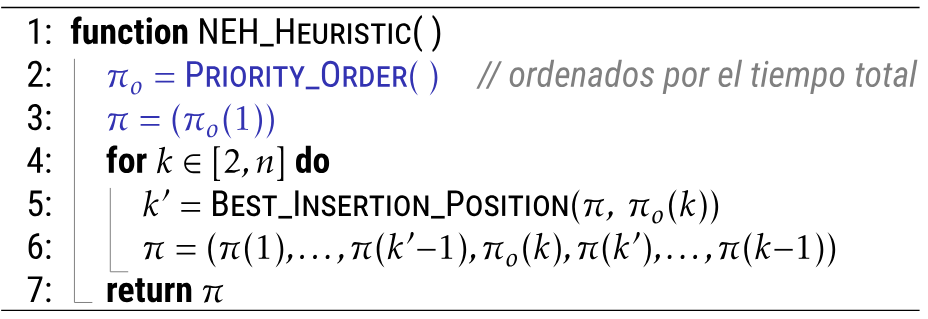
  <p><em>Figura 4: Heurística NEH [1]</em></p>
</div>

---

- Si ocurre empates al realizar la segunda etapa, se ha probado que existe una 
técnica para solucionar este problema. Por el momento, solo tomamos el orden 
del primer resultado.

- La calidad de la solución se mide con el desvío relativo:


--- 

Taillard realiza dos análisis fundamentales para aplicar esta aceleración. 
Supongamos que ya hemos programado 4 trabajos en 4 máquinas. Entonces, **¿dónde 
podemos agregar un quinto trabajo?**

##### Los tiempos de finalización más tempranos

Imaginemos que empujamos todos los trabajos hacia el inicio, lo más posible. Es 
decir, el procesamiento de un trabajo pasa a la siguiente máquina justo cuando 
culmina su procesamiento en la anterior.

**Conclusión:** Si insertamos el quinto trabajo en cualquier lugar, los tiempos de 
finalización en cada máquina de los trabajos procesados antes del nuevo trabajo 
insertado <strong>no cambian</strong>.

<div style="text-align: center;">
  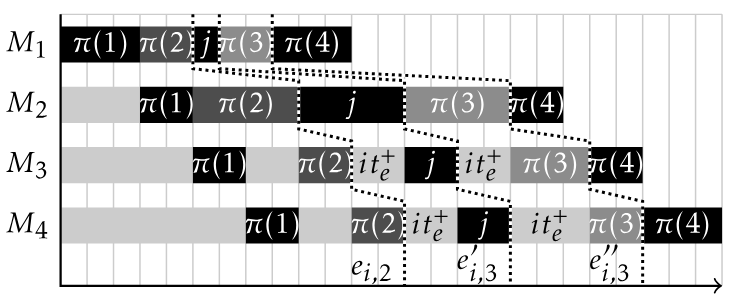
  <p><em>Figura 1: Tiempos de finalización más tempranos</em></p>
</div>

##### Los tiempos de iniciación más tardíos

Imaginemos que empujamos todos los trabajos hacia el final, lo más posible. 
Recordemos que los tiempos de procesamiento de cada trabajo en cada máquina varían, 
por lo que pueden quedar espacios sin uso. Estos espacios pueden ser ocupados por 
los trabajos procesados anteriormente en esa máquina.

**Conclusión:** Si insertamos el quinto trabajo en cualquier lugar, los tiempos de 
iniciación tardía en cada máquina de los trabajos procesados después del nuevo 
trabajo insertado <strong>no cambian</strong>.

<div style="text-align: center;">
  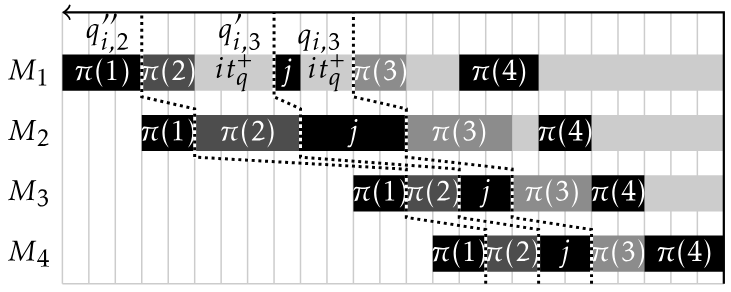
  <p><em>Figura 2: Tiempos de iniciación más tardíos</em></p>
</div>

---

## 2.4. Heurística de Búsqueda local

Comienzan desde una solución inicial (puede ser aleatoria), intentan reemplazar 
la solución actual por una mejor solución vecina, repiten este paso hasta que 
no hayan mejores soluciones vecinas. La pregunta que que ayuda a diseñar 
correctamente la Heurística es: 

> **¿Qué cambio podría mejorar esta solución?**

<div style="text-align: center;">
  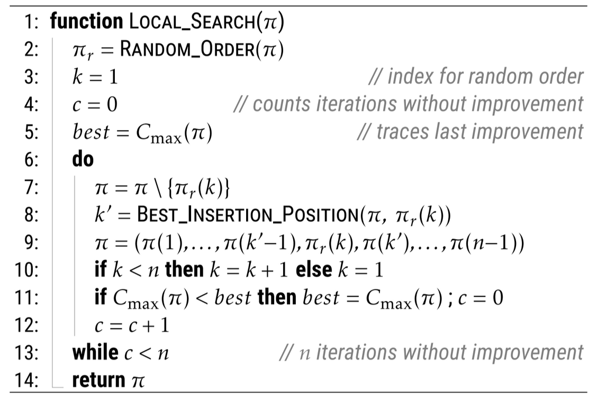
  <p><em>Figura 5: Heurística de Búsqueda Local [1]</em></p>
</div>

## 2.5. Búsqueda local iterativa

Fue propuesta por Stützle (1998). La figura 6 muestra los principales 
pasos de la búsqueda local iterativa. La búsqueda local iterativa repite estos 
pasos guardando la mejor solución producida hasta un criterio de parada definida.

<div style="text-align: center;">
  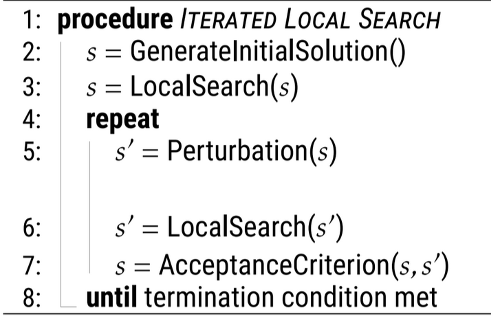
  <p><em>Figura 6: Búsqueda Local Iterativa [5]</em></p>
</div>

A continuación explicamos los principales componentes de la búsqueda local 
iterativa.

- **Solución inicial**. El primer componente construye la solución inicial. Esta 
puede generarse de manera aleatoria o utilizando un método heurístico que 
proporcione una buena solución inicial, lo cual puede mejorar la eficiencia del algoritmo. En este caso hemos utilizado **Heurística de Búsqueda Local**.

- **Perturbación**. El segundo componente se encarga de alterar la solución para 
escapar de óptimos locales. Esto se realiza aplicando un intercambio.

- **Búsqueda local**. Este es el componente principal de la búsqueda local 
iterativa. Se encarga de ir al siguiente óptimo local.

- **Criterio de aceptación**. Estos criterios se encargan de equilibrar dos 
estrategias de búsqueda: la diversificación y la intensificación. Diversificar 
la búsqueda consiste en explorar nuevas áreas del espacio de búsqueda para evitar 
quedarse atrapado en óptimos locales. Intensificar la búsqueda se enfoca en explotar 
las áreas más prometedoras del espacio de búsqueda para refinar la solución.

    **Stützle (1998) propuso tres criterios de aceptación.**

    - **Criterio de aceptación "Better"**. Consiste en aceptar únicamente las 
    soluciones que son mejores que la actual. Es decir, intensifica la búsqueda 
    al concentrarse en las áreas cercanas al óptimo local.

    - **Criterio de aceptación "Random Walk"**. Consiste en aceptar soluciones de 
    manera aleatoria, independientemente de su calidad relativa. Es decir, 
    diversifica la búsqueda al permitir explorar áreas menos prometedoras.

    - **Criterio de aceptación de "Simulated Annealing"**. Consiste en aceptar 
    soluciones peores con una probabilidad decreciente en función de una 
    temperatura simulada. Es decir, equilibra la diversificación y 
    la intensificación de la búsqueda.

## 2.6. Algoritmo iterativo goloso

Fue propuesto por Ruiz y Stützle (2007). La figura 7 muestra los principales 
pasos del algoritmo iterativo goloso. El algoritmo iterativo goloso repite estos 
pasos guardando la mejor solución producida hasta un criterio de parada definida.

<div style="text-align: center;">
  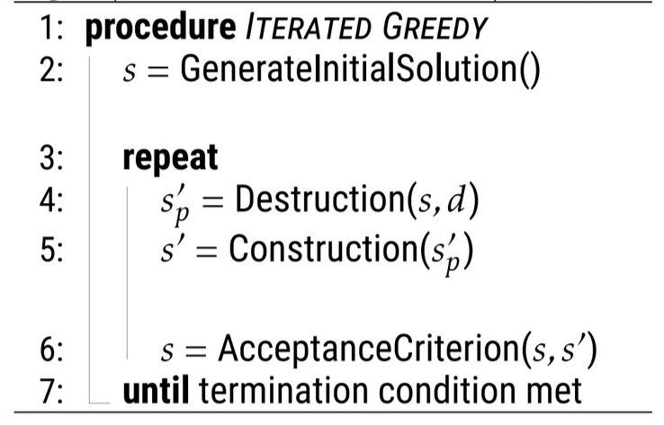
  <p><em>Figura 7: Algoritmo Iterativo Goloso [5]</em></p>
</div>

A continuación explicamos los principales componentes del algoritmo iterativo goloso.

- **Solución inicial**. El primer componente construye la solución inicial. Puede 
generarse utilizando la heurísticas constructiva NEH.

- **Destrucción** Este componente se encarga de eliminar aleatoriamente algunos 
elementos de la solución actual [1] generando una solución parcial. Esto permite 
explorar nuevas configuraciones en el espacio de búsqueda.

- **Reconstrucción**. Este componente se encarga de reinsertar los elementos
eliminados usando una heurísticas constructiva golosa para construir una nueva 
solución.

- **Criterio de aceptación** Ruiz y Stützle [5] proponen utilizar el criterio de
aceptación de "Simulated Annealing".

---

Existe una extensión natural del algoritmo iterativo goloso que incorpora una 
búsqueda local tras cada reconstrucción. Esta combinación mejora la calidad de 
las soluciones encontradas al refinar las configuraciones obtenidas. La Figura 8 
ilustra este enfoque extendido.

<div style="text-align: center;">
  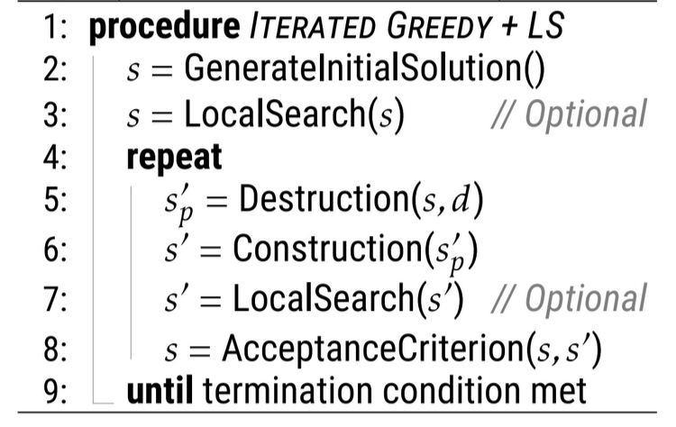
  <p><em>Figura 8: Algoritmo Iterativo Goloso con Búsqueda Local [5]</em></p>
</div>

# 3. Diseño experimental

Nuestro objetivo en esta sección será implementar 2 heurísticas básicas: heurística 
Constructiva y heurística de búsqueda local, para calcular el `makespan` de FSSP. 

## 3.1. Objetivos

Los objetivos de este trabajo son:

- Reforzar los conocimientos de los métodos heurísticos básicos y de metaheurísticas.
- Aplicar estos métodos para resolver el FSSP.

## 3.2. Actividades

Lo primero que vamos hacer es cargar correctamente las instancias que 
analizaremos, luego implementaremos el cálculo del `makespan` de una permutación 
específica, finalmente implementaremos las dos heurísticas propuestas para 
calcular la **permutación óptima**.

### 3.2.1. Instancias de FSSP

En el directorio [flowshop/](./flowshop/) se encuentran 121 instancias. Las 
instancias son archivos con el formato *ASCII text* los cuales estan disponibles 
para ser cargados y usados en el cálculo del `makespan`. El formato de archivo de 
datos para el FSSP comienza con dos números en la primera linea: el número de 
trabajos y el número de máquinas [2]. Por ejemplo, veamos la estructura de la 
instancia [flowshop/br66](./flowshop/br66)

```zsh
6 6
0 3.2 6 2 3 3 3 4 4 5 3
0 4 1 3 2 5 3 3 4 5 5 2
0 6 1 5 2 2 3 2 4 2 5 4
0 4 1 5 2 2 3 2 4 5 5 5
0 2 1 2 2 5 3 6 4 3 5 5
0 2 1 3 2 5 3 5 4 3 5 3
```
Luego, el archivo tiene *nT* líneas, una para cada trabajo. Cada línea tiene *2 x mM*
columnas para ese trabajo; es decir, tiene dos columnas para cada actividad de ese 
trabajo: **el número de la máquina y le timepo de procesamiento** [2].

### 3.2.2. La función `cargar`

El objetivo es cargar correctamente una instancia en una arreglo bidimensional 
(matriz). En esta ocasión a nosotros solo nos importa los tiempos de procesamiento 
de cada trabajo en cada máquina, por ello vamos a obviar cargar el número de la 
máquina.

```cpp
#include <bits/stdc++.h>
using namespace std;

int nT, mM, P[900][70];

void cargar(string nombre) {
  ifstream archivo(nombre);
  archivo >> nT >> mM;
  int basura;
  for (int j = 0; j < nT; j++)
    for (int i = 0; i < mM; i++)
      archivo >> basura >> P[j][i];
}
```

Como observamos, *nT* y *mM* es el número de trabajos y el número de máquinas, 
respectivamente. Luego, *basura* es el **número de la máquina**, que nos nos 
importa en este análisis. Podemos comprobar la carga exitosa imprimiendo los 
valores desde la matriz *P*.

```cpp
int main(void) {
  cargar("flowshop/br66");
  for (int j = 0; j < nT; j++) {
    for (int i = 0; i < mM; i++)
      cout << P[j][i] << " ";
    cout << "\n";
  }
}
```

Como resultado tenemos que la matriz de tiempos de procesamiento, donde 
**<samp>P[j][i]</samp>** indica el tiempo necesario para que la tarea 
**<samp>j</samp>**se procese en la máquina **<samp>i</samp>**., donde confirmamos 
la correcta carga de los datos de cualquier instancia con el formato presentado.

```zsh
3 6 3 3 4 3
4 3 5 3 5 2
6 5 2 2 2 4
4 5 2 2 5 5
2 2 5 6 3 5
2 3 5 5 3 3

```

### 3.2.3. La función `makespan`

El `makespan` es el tiempo total de procesamiento de los **<samp>j</samp>** 
trabajos en las **<samp>i</samp>** máquinas (no confudir con el tiempo de la 
suma de procesamientos de los **<samp>j</samp>** trabajos en las 
**<samp>i</samp>** máquinas). Analicemos un ejemplo con la siguiente 
permutación.

<div style="text-align: center;">
  
  <p><em>Figura 4: Una posible permutación [1]</em></p>
</div>

En este caso, el `makespan` es **43**. Para hallar este número podemos calcular 
los tiempo de iniciación más temprana para cada trabajo en cada máquina. Luego, 
una vez obtenida dicha matriz, estaremos seguros de que la última fila y en la 
última fila se encuentra el `makespan` de esa permutación.

```cpp
int EF[900][70];

int makespan(vector<int> &S) {
  fill(&EF[0][0], &EF[0][mM], 0);
  int k = 1;
  for (auto j : S) {
    EF[k][0] = EF[k - 1][0] + P[j][0];
    for (int i = 1; i < mM; i++)
      EF[k][i] = max(EF[k - 1][i], EF[k][i - 1]) + P[j][i];
    k++;
  }
  return EF[S.size()][mM - 1];
}
```

Podemos volver a la figura 4 para entender por qué calculamos el máximo valor 
entre el tiempo de procesamiento **del trabajo anterior en la misma máquina** y 
**el trabajo actual en la anterior máquina**. Observe como ejemplo al trabajo 3 
en la última máquina **<samp>(M6)</samp>**.

Para probar la eficacia, tenemos como resultado el siguiente output para la 
permutación propuesta como ejemplo.

```cpp
int main(void) {
  cargar("flowshop/br66");
  cout << nT << "x" << mM << "\n";

  S = {4, 3, 5, 1, 0, 2};
  cout << makespan(S) << "\n";
}
```

```zsh
6x6
43
```

### 3.2.4. Implementación Heurística Constructiva NEH

Veremos cómo utilizando la aceleración de Taillard mejoramos la eficiencia del 
paso **"cómo o dónde"** añadir el trabajo.

#### La función `prioridadNEH`
La función es sencilla, implementa el cálculo de la prioridad para la heurística 
constructiva de Nawaz-Enscore-Ham (NEH). Consiste en dos pasos importantes: 
calcular el tiempo total de procesamiento para cada trabajo sumando sus tiempos 
en todas las máquinas, luego se ordena los trabajos de forma descendente según 
sus tiempos totales.

```cpp
void PrioridadNEH(vector<int> &Orden) {
  vector<int> TT;
  TT.resize(nT);

  for (int j = 0; j < nT; j++) {
    int t = 0;
    for (int i = 0; i < mM; i++) t = t + P[j][i];
    TT[j] = t;
  }

  Orden.resize(nT);
  iota(Orden.begin(), Orden.end(), 0);
  sort(Orden.begin(), Orden.end(),
      [&TT] (const int &i, const int &j) {
        return (TT[i] > TT[j] or (TT[i] == TT[j] and i < j));
      });
}
```

Podemos verificar el correcto ordenamiento haciendo la siguiente prueba unitaria

```cpp
int main(void) {
  cout << "\nExample of PrioridadNEH\n";

  vector<int> ss;
  PrioridadNEH(ss);
  for (auto &j : ss) cout << j << ",";
  cout << "\n";
}
```
```zsh
Example of PrioridadNEH
3,4,0,1,2,5,
```

#### Aceleración de `Taillard` (1990)

Recordando el análisis descrito en la sección 2.3. los pasos que sigue Taillard para
calcular la mejor posicion de inserción son los siguiente:

Sea 

- 1. Calcular los **tiempos de finalización más tempranos**

<div style="text-align: center;">
  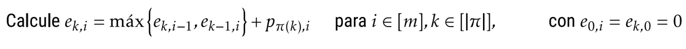
  <p><em>Figura 3: Formula de los tiempos de finalización más tempranos</em></p>
</div>

<div style="text-align: center;">
  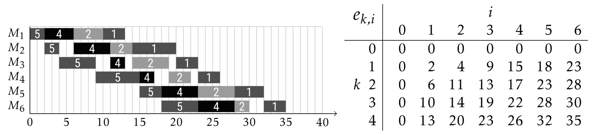
  <p><em>Figura 3: Matriz de los tiempos de finalización más tempranos</em></p>
</div>

- 2. Calcular los tiempos de finalización con el nuevo trabajo insertado en cada posición

<div style="text-align: center;">
  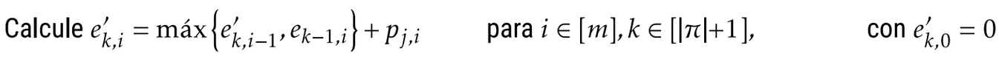
  <p><em>Figura 4: Formula tiempos de finalización más tempranos con J_3</em></p>
</div>

<div style="text-align: center;">
  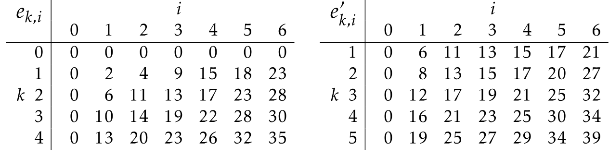
  <p><em>Figura 4: Matriz de los tiempos de finalización más tempranos con $J_3$</em></p>
</div>

- 3. Calcular los **tiempos de iniciación más tardíos**

<div style="text-align: center;">
  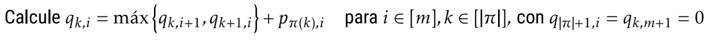
  <p><em>Figura 5: Formula de tiempos de iniciación más tardíos</em></p>
</div>

<div style="text-align: center;">
  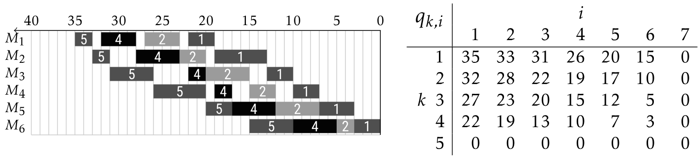
  <p><em>Figura 5: Matriz de tiempos de iniciación más tardíos</em></p>
</div>

- 4. Calcular el Makespan

<div style="text-align: center;">
  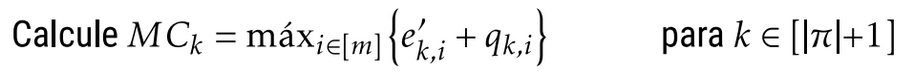
  <p><em>Figura 6: Formula de suma de las matrices y mayor valor de cada fila</em></p>
</div>

<div style="text-align: center;">
  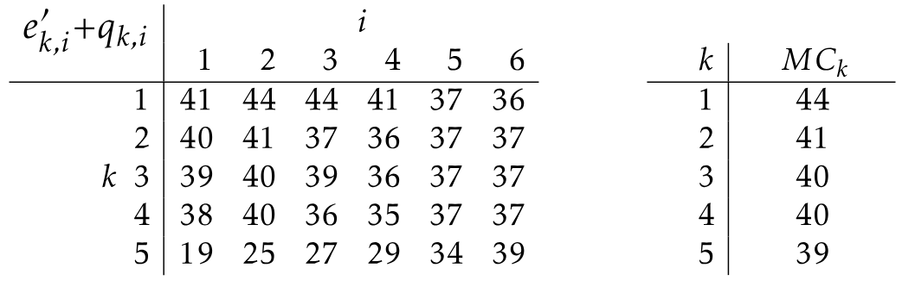
  <p><em>Figura 6: Suma de las matrices y mayor valor de cada fila</em></p>
</div>

##### Complejidad temporal de NEH

Con esta aceleración, NEH inserta los <samp>n</samp> trabajos en un tiempo 
<samp>O(n^2 m)</samp>.

<div style="text-align: center;">
  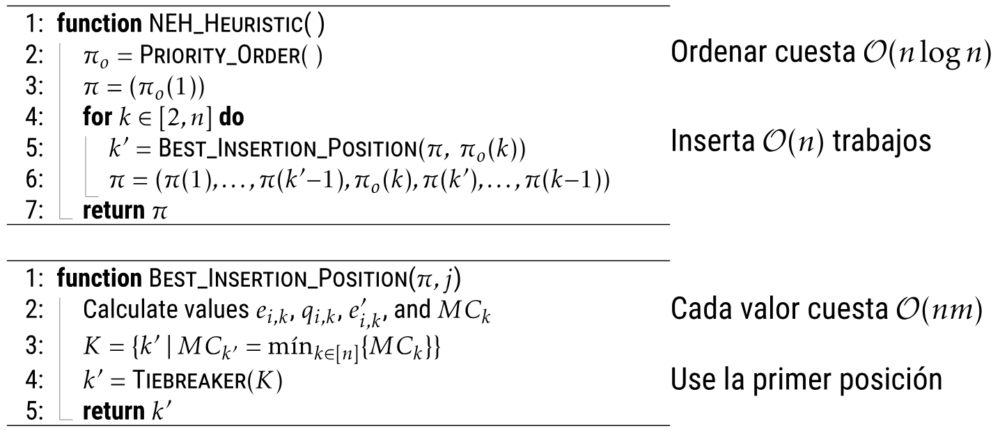
  <p><em>Figura 7: Complejidad temporal</em></p>
</div>

---

```cpp
tuple<int, vector<int>::iterator> MejorPosicisionInsercion(vector<int> &S, int nj) {
  fill(&EF[0][0], &EF[0][mM], 0);
  for (int k = 1; k <= S.size(); k++) {
    int j = S[k - 1];
    EF[k][0] = EF[k - 1][0] + P[j][0];
    for (int i = 1; i < mM; i++)
      EF[k][i] = max(EF[k - 1][i], EF[k][i - 1]) + P[j][i];
  }

  for (int k = 0; k <= S.size(); k++) {
    EF[k][0] += P[nj][0];
    for (int i = 1; i < mM; i++)
      EF[k][i] = max(EF[k][i], EF[k][i - 1]) + P[nj][i];
  }

  fill(&LS[S.size()][0], &LS[S.size()][mM], 0);
  for (int k = S.size() - 1; k >= 0; k--) {
    int j = S[k];
    LS[k][mM - 1] = LS[k + 1][mM - 1] + P[j][mM - 1];
    for (int i = mM - 2; i >= 0; i--)
      LS[k][i] = max(LS[k][i + 1], LS[k + 1][i]) + P[j][i];
  }

  int bmk = numeric_limits<int>::max(), mk, pos;
  for (int k = 0; k <= S.size(); k++) {
    mk = 0;
    for (int i = 0; i < mM; i++)
      if (mk < EF[k][i] + LS[k][i])
        mk = EF[k][i] + LS[k][i];
    if (mk < bmk) { bmk = mk; pos = k; }
  }

  return {bmk, S.begin() + pos};
}
```

Finalmente, sabiendo dónde es la mejor posición de inserción, podemos construir 
la heuritica constructiva NEH

```cpp
int NEH(vector<int> &S) {
  int mk;
  vector<int> orden;
  PrioridadNEH(orden);
  S = {orden[0]};
  for (int k = 1; k < nT; k++) {
    vector<int>::iterator pos;
    tie(mk, pos) = MejorPosicisionInsercion(S, orden[k]);
    S.insert(pos, orden[k]);
  }
  return mk;
}

```

### 3.2.5. Implementación Heurística de Búsqueda Local

Para poder resinsertar un elemento en otra posición de la misma vecindad, usamos la 
aceleración de Taillard.

```cpp
int BusquedaLocal(vector<int> &S, int pmk = 0) {
  vector<int> orden(S);
  shuffle(orden.begin(), orden.end(), Rand);
  int k = 0;
  int c = 0;
  int bmk = pmk;
  if (bmk == 0) bmk = makespan(S);
  do {
    int mk; vector<int>::iterator pos;
    S.erase(find(S.begin(), S.end(), orden[k]));
    tie(mk, pos) = MejorPosicisionInsercion(S, orden[k]);
    S.insert(pos, orden[k]);
    if (mk < bmk) { bmk = mk; c = 0; }
    k++; if (k >= nT) k = 0;
    c++;
  } while (c < nT);
  return bmk;
}
```
 
### 3.2.6. Implementación Búsqueda local iterativa (ILS)

Podemos ver las implementaciones con los 3 criterios en el archivo 
[flowshop](./flowshop.cpp), pero en esta sección solo mostraremos la 
implementación con el criterio de aceptación Simulated Annealing.

```cpp
int ILS_SA(vector<int> &BS) {
  vector<int> S, NS;
  int mk, bmk, nmk;
  int sum_p = 0;

  for (int j = 0; j < nT; j++)
    for (int i = 0; i < mM; i++)
      sum_p += P[j][i];
  double T = double(sum_p) / (nT * mM * 25);

  elapsed(true);
  bmk = mk = NEH(S);
  bmk = mk = BusquedaLocal(S);
  BS = S;

  while (elapsed() < 15 * nT * mM) {
    NS = S;
    auto b1 = NS.begin() + Rand() % NS.size();
    auto b2 = NS.begin() + Rand() % NS.size();
    swap(*b1, *b2);
    b1 = NS.begin() + Rand() % NS.size();
    b2 = NS.begin() + Rand() % NS.size();
    swap(*b1, *b2);

    nmk = BusquedaLocal(NS);
    if (nmk < mk) {
      S = NS; mk = nmk;
      if (mk < bmk) {BS = S; bmk = mk;}
    } else if (double(Rand()) / Rand.max() <= 
          exp(-(double(nmk - mk) / T))) {
      S = NS; mk = nmk;
    }
  }

  return bmk;
}
```

### 3.2.7. Implementación Algoritmo iterativo goloso (IG)

El siguiente código es la implementacion del algoritmos iterativo goloso sin 
usar la Búsqueda Local, como se observa solo hemos comentado dos lineas donde
se actualiza el valor de <samp>bmk</samp> y <samp>nmk</samp>

```cpp
int IGnoLS(vector<int> &BS) {
  vector<int> S, NS, R;
  R.resize(4);
  int mk, bmk, nmk;
  int sum_p = 0;

  for (int j = 0; j < nT; j++)
    for (int i = 0; i < mM; i++)
      sum_p += P[j][i];
  double T = double(sum_p) / (nT * mM * 25);

  elapsed(true);
  bmk = mk = NEH(S);
  // bmk = mk = BusquedaLocal(S);
  BS = S;

  while (elapsed() < 15 * nT * mM) {
    NS = S;
    for (auto &j : R) {
      auto b1 = NS.begin() + Rand() % NS.size();
      j = *b1;
      NS.erase(b1);
    }
    for (auto &j : R) {
      vector<int>::iterator pos;
      tie(nmk, pos) = MejorPosicisionInsercion(NS, j);
      NS.insert(pos, j);
    }

    // nmk = BusquedaLocal(NS, nmk);
    if (nmk < mk) {
      S = NS; mk = nmk;
      if (mk < bmk) {BS = S; bmk = mk;}
    } else if (double(Rand()) / Rand.max() <= 
          exp(-(double(nmk - mk) / T))) {
      S = NS; mk = nmk;
    }
  }

  return bmk;
}

```

# 4. Resultados

| Método   | Sj    | ILS B  | ILS RW  | ILS SA  | IG     | IG no LS | ARPD     |
|----------|-------|--------|---------|---------|--------|----------|----------|
| ILS B    | 308.4 | 0      | 144     | 90.85   | 190.5  | 129.65   | 0.84178  |
| ILS RW   | 452.4 | 144    | 0       | 234.85  | 334.5  | 273.65   | 1.48651  |
| ILS SA   | 217.55| 90.85  | 234.85  | 0       | 99.65  | 38.8     | 0.63648  |
| IG       | 117.9 | 190.5  | 334.5   | 99.65   | 0      | 60.85    | 0.45888  |
| IG no LS | 178.75| 129.65 | 273.65  | 38.8    | 60.85  | 0        | 0.57968  |

**Prueba Mack-Skilling:**
- **MS:** 319.2060
- **α = 0.005:** χ²(k-1,α) = 14.86025 → Hay diferencias significativas.
- **P(χ²):** 0
- **Mínima diferencia significativa (mindif):** 71.2397


## 4.1. Desempeño Relativo de los Algoritmos

- El algoritmo IG (Iterativo Goloso) obtiene el menor ARPD (0.45888), indicando 
el mejor desempeño relativo entre los algoritmos analizados.

- Le sigue el algoritmo IG sin búsqueda local (IG no LS) con un ARPD de 0.57968, 
mostrando un impacto positivo de la búsqueda local en el rendimiento del IG.

- El ILS SA (Simulated Annealing) obtiene un ARPD de 0.63648, posicionándose como 
una opción intermedia en términos de calidad.

## 4.2. Rendimiento de ILS RW y ILS B

- El ILS RW tiene el mayor ARPD (1.48651), lo que sugiere que la técnica aleatoria 
utilizada no es competitiva frente a las demás.

- Por otro lado, ILS B tiene un ARPD de 0.84178, demostrando un desempeño 
aceptable pero no óptimo.

## 4.3. Prueba Mack-Skilling

La prueba estadística no paramétrica Mack-Skilling confirma que existen diferencias significativas entre los métodos analizados con un nivel de confianza del 99.5%

## 4.4. Mínima diferencia significativa

La diferencia mínima necesaria para distinguir significativamente entre métodos es 71.2397, lo que refuerza la evidencia estadística a favor del mejor desempeño del IG.

En general, el análisis muestra que el IG y sus variantes superan al resto de los métodos en términos de calidad de las soluciones obtenidas, confirmando su efectividad en el contexto evaluado.

# 5. Conclusiones

En conclusión, los resultados obtenidos destacan al algoritmo Iterativo Goloso (IG) 
como el enfoque más eficiente y robusto para resolver el problema analizado, 
especialmente cuando se combina con búsqueda local. Además, el análisis 
estadístico confirma diferencias significativas entre los algoritmos evaluados, 
subrayando la importancia de seleccionar estrategias adecuadas para optimizar 
el rendimiento. Los hallazgos reafirman la relevancia de integrar búsqueda local 
en los algoritmos iterativos y establecen al IG como una herramienta efectiva en 
este campo.

# 6. Referencias Bibliograficas

- [1] A. Benavides, "FSSP: IMPOSIBLE" presentado en el curso de Análisis y 
Diseño de Algoritmos, Universidad Nacional de San Agustin, Arequipa, Perú, 2024.

- [2] A. Benavides, "Programa inicial para FSSP con C++," presentado en el curso 
de Análisis y Diseño de Algoritmos, Universidad Católica San Pablo, Arequipa, 
Perú, 2022.

- [3] M. Nawaz, E. E. Enscore Jr, and I. Ham, "A heuristic algorithm for the 
m-machine, n-job flow-shop sequencing problem," Omega, vol. 11, no. 1, pp. 
91–95, 1983.

- [4] R. Ruiz and T. Stützle, "A simple and effective iterated greedy algorithm 
for the permutation flowshop scheduling problem," European Journal of Operational 
Research, vol. 177, no. 3, pp. 2033–2049, 2007.

- [5] T. Stützle, "Applying iterated local search to the permutation flow shop 
problem," Technical Report AIDA–98–04, FG Intellektik, TU Darmstadt, 1998.

